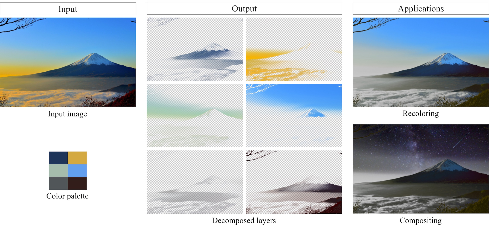

# Fast Soft Color Segmentation
This repository was developed as a part of an internship in the summer of 2019.



## Usage
### Training
- Prepare a train dataset
- Prepare CSV files for image paths and corresponding palette values, like ```sample.csv``` and ```palette_7_sample.csv```.
- Run ```train.py``` with arguments.


### Inference
[Inference.ipynb](src/inference.ipynb) shows a sample decomposition with apple.jpg. Run it in order from top.
If you want to use other images, please change:
```
# image name and palette color values
img_name = 'apple.jpg'; manual_color_0 = [253, 253, 254]; manual_color_1 = [203, 194, 170]; manual_color_2 = [83, 17, 22]; manual_color_3 = [205, 118, 4]; manual_color_4 = [220, 222, 11]; manual_color_5 = [155, 24, 10]; manual_color_6 = [171, 75, 67];
```  

```manual_color_X``` means user-specified RGB values. If necessary, K-means algorithm (bottom of the notebook) give you these values.  

## Notes
- This is developed on a Linux machine running Ubuntu 16.04
- Distributed pretrained model is for 7 layer decomposition.
- The copyright of apple.jpg belongs to [Adelle Chudleigh](https://www.deviantart.com/gothicwolfcorpse).
